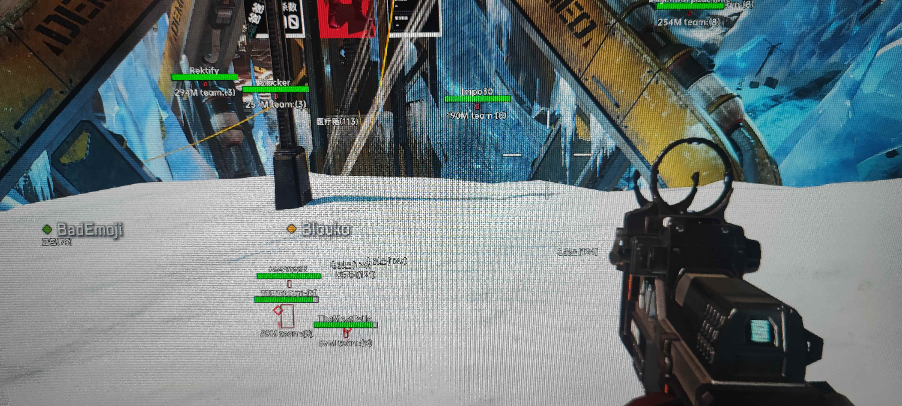
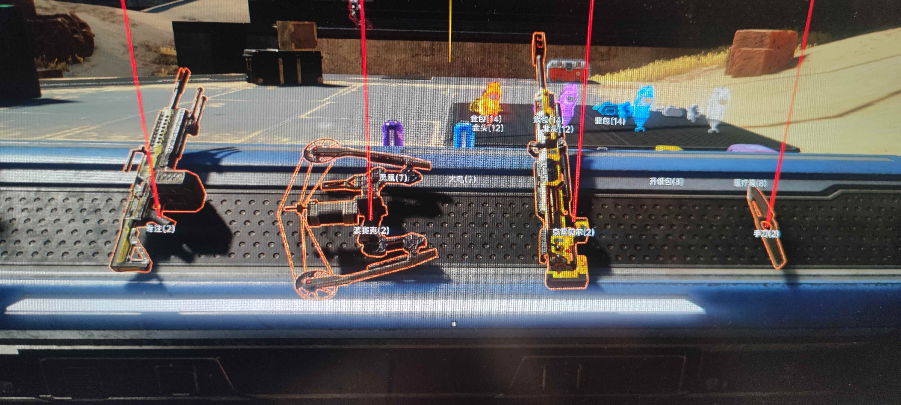
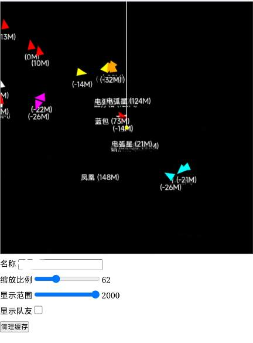

# ADM
Apex Dma 方框、辅助瞄准、网页地图分享, 支持Windows和Linux上运行

# Telegram
* [✈️飞机群](https://t.me/+R3hf2s4ZVF81YmZl)

# 注意
- 辅助瞄准顾名思义就是用来辅助的，如果想完全当自瞄用，就把瞄准速度拉满，拉满不出一天号就没了

# 图片
* 方框
  
* 物品
  
* 网页地图
  
# 网页地图功能地址
* 运行ADM后访问下面地址
* http://127.0.0.1:6888/map.html
# 克隆
* 因为有子模块需要用下面命令克隆
* `git clone --recursive https://github.com/bbgsm/ADM.git`

# 编译
- Windows
编译环境: Clion + cmake + vs2022, 在 Clion 的 cmake 配置中选择vs2022编译工具链进行编译
- Linux
编译环境: Clion + cmake + Unix Makefiles, 在 Clion 的 cmake 配置中选择Unix Makefiles编译工具
    还需要安装: `sudo apt install libglfw3-dev`
   Linux 下编译完成后运行还需要需要把 [vmm.so] [leechcore.so] [leechcore_ft601_driver_linux.so] 三个库文件复制到/usr/lib64/下
  并且用root权限执行

# 测试环境
#### Windows
- 主机: Windows 11 + CaptainDMA 75T + KmBoxNet
- 副机: Windows 11 
#### Linux
- 主机: Windows 11 + CaptainDMA 75T + KmBoxNet
- 副机: Ubuntu arm64 香橙派5 
- Linux X64 待开发....

# 目录
* [cheat 作弊主目录](cheat)
* [blockScreen 黑屏背景(融合器背景专用)](blockScreen)
* [CEPlugin DMA读取整合cheat，方便绘制和CE同时运行在DMA上](CEPlugin)
* [MemTools 内存工具目录](MemTools)
* [render imgui绘制工具](render)
* [webMap 网页功能代码](webMap)
* [libhv C++网络工具](libhv)
* [testGui imgui绘制测试](testGui)
## 关于
* [CheatEngine-DMA(CE DMA内存插件)](https://github.com/Metick/CheatEngine-DMA)
* [libhv(C++网络工具)](https://github.com/ithewei/libhv)
* [imgui(C++绘制)](https://github.com/ocornut/imgui)
* [MemTools(内存读写、dump工具)](https://github.com/bbgsm/MemTools)
* [mINI(ini配置文件工具)](https://github.com/metayeti/mINI.git)